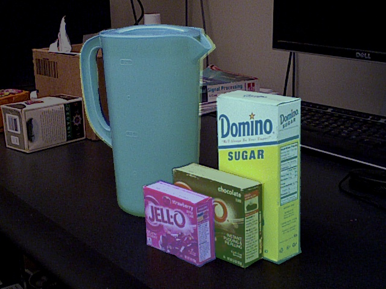

### Training Neural Networks for 6DOF Pose Estimation

The goal of this assignment is to make you familiar with training neural networks
for computer vision subtasks involved in building robotic systems.  We will be
working on a 6DOF pose estimation task for known objects. Given a 480 x 640 RGB
image with multiple objects in it, and a bounding box around one of the objects,
we want a model that can predict a) the identity of the object (out of 13 total
objects) and b) the pose of the object, denoted by rotation (3 x 3 matrix) and 
translation (3 x 1 vector) of the object in the camera space. Here is a sample 
image of the scene for which we want to predict the pose of the object:



Such a state estimation task is useful for robotic manipulation in known
settings. For example knowing the 6DOF pose can help plan grasps /
non-prehensile pushing actions (say). 6DOF pose estimation is also used to
transfer training labels onto real images, to train neural networks that can
directly predict grasps from images, as done, for example, in the [AnyGrasp
work](https://arxiv.org/abs/2212.08333).


### Infrastructure

We are giving you a dataset (train, val, test splits) where each sample looks as
follows: (image, bounding box, object identity, rotation (3x3 matrix),
translation (3x1 vector)). You can download the dataset from
[ycbv-v1.zip](https://saurabhg.web.illinois.edu/teaching/ece598sg1/sp2025/mp1/ycbv-v1.zip).
The dataset is a subset of the [YCB-Video
dataset](https://paperswithcode.com/dataset/ycb-video) processed using the [BOP
Toolkit](https://bop.felk.cvut.cz/datasets/). Download `ycbv-v1.zip` and unzip
it in the `data` directory to obtain a directory `./data/ycbv/v1/`.

We have also written a dataloader in [dataset.py](dataset.py), a training script
in [demo.py](demo.py), a simple neural network model (network.py)[network.py].
You can run the following command to get started:

```
CUDA_VISIBLE_DEVICES=0 python3 demo.py --output_dir runs/basic
```

This trains a simple model for 10 epochs, logs training and validation losses
and metrics in `runs/basic` and also saves the test set predictions for the best
model. You will be uploading the test set predictions to Gradescope for grading.
As is, the model is not very good, and you will need to improve it to get a good
score.

### Metrics
At inference time, you will be given an image and a bounding box. Your model 
needs to predict a) which of the 13 objects it is, and b) its pose (rotation
matrix and translation vector). We will use the following metrics to evaluate
the performance of your model. 
- `cls_accuracy`: accuracy of the predicted class
- `cls_R_accuray`: class was correct and predicted rotation was within 0.5
radians
- `cls_t_accuracy`: class was correct and predicted translation was within 0.1
metres
- `cls_R_t_accuracy`: class was correct and predicted rotation and translation
were within 0.5 radians and 0.1 metres respectively

### Your Work

Develop the model, training recipe, and hyperparameters to improve the performance 
of the model. You can do anything you like except for the following:
- You cannot change the backbone. You can only use a ResNet 18 backbone pre-trained on the ImageNet dataset.
- You cannot change the dataset. You can only use the dataset we have provided to you.
Outside of these, you are welcome to change anything you like. You can also roll
your own code if you'd like, but we recommend that you use the code we have
provided to you as a starting point.

Here are some suggestions for what you can consider changing:

1. Current model uses full images as input, and concatenates the bounding box
location to features from the image. This is not a very good architecture.
Consider feeding in image crops instead of the full image. Alternatively, you
can use a [RoIAlign](https://arxiv.org/abs/1703.06870) or
[RoIPool](https://arxiv.org/abs/1504.08083) layer to crop out features
corresponding to the bounding box from an apprpriate layer in the CNN. Cropping 
the image will also have the benefit that the model will be faster to train.

2. The current model uses a single head, that is shared across different
objects, to predict rotation and translation. This can also make learning hard.
Consider making predicting 13 different rotations and translations, one for each
object. That may make learning simpler. You willl need to modify the loss
functions accordingly and also change the `process_output` function in
[network.py](network.py) to return the output corresponding to the predicted
class.

3. Rotation is being predicted by simply regressing to the 9 numbers in the
rotation matrix. That may not be a good idea. Specifically, it doesn't take into
accound that rotation matrices are orthonormal. You can study different
different representations for predicting rotations, such as axis-angle,
quaternion, 6D rotation representation, etc. My understanding is that predicting
[6D rotations works the best](https://arxiv.org/abs/1812.07035), but you are
welcome to try different things.

4. Even whe you input crops into the nwtwork, you may still find it helpful to
input the location of the bounding box in the original image into the network,
see [Mitigating Perspective Distortion-induced Shape
Ambiguity](https://ap229997.github.io/projects/ambiguity/assets/paper.pdf).

5. You may find benefits from using a denoising loss in predicting rotations and
translations. The output distribution is not multi-modal but some past papers
report benefits of iterative predictions (e.g. these past paper, [Iterative
Error Feedback](https://arxiv.org/abs/1507.06550) and
[HMR](https://akanazawa.github.io/hmr/)). Consider training models with these
loss functions.

6. Outside of that, there may be the usual tricks for training networks that you
can try: data augmentation, better optimizers, better learning rate schedules,
different architectures, different loss functions.

### Submission
You will need to submit the following to Gradescope:
- *MP1-part2-code* [20 pts Autograded]:
    - Your test set predictions. 
    - Your code, including `network.py`, `dataset.py`, `demo.py`, `utils.py`, and any other files that you write, as `.py` files.
- *MP1-part2-report* [10 pts Manual Grading]:
    - A report that describes what changes you made and what impact did those
    have on the performance of your model. Consider making a table with *control
    experiments*, where you compare the performance of different changes you
    made to the models, training recipes, and hyperparameters.
    - Your final model, training recipe, and hyperparameters.
    - A plot of the validation metrics over epochs for your best (or close to best) model.
    